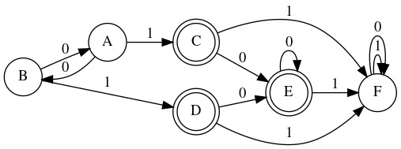
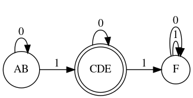

# Py-Automata Algorithms 
(Automata Theory algorithms implemented via Python3)

I initiated this repository to explore and implement methods within the realm of automata theory.

## 1. Deterministic Finite Automata (DFA) Minimization 

min.py contains an implementation of the minimization of DFA via the table-filling method, aka Myhill-Nerode Theorem. 

Given an input DFA system <Q, q0, E, F, D> the algorithm minimizes it if possible, by 
grouping together redundant states.

```python
Before min:  {
              'A0': 'B', 
              'A1': 'C', 
              'B0': 'A', 
              'B1': 'D', 
              'C0': 'E', 
              'C1': 'F', 
              'D0': 'E', 
              'D1': 'F', 
              'E0': 'E', 
              'E1': 'F', 
              'F0': 'F', 
              'F1': 'F'
              }
```



```python
After min:  {
            'AB0': 'AB', 
            'AB1': 'CDE', 
            'CDE0': 'CDE', 
            'CDE1': 'F',
            'F0': 'F', 
            'F1': 'F'
            }

```


where '0' and '1' are state inputs.

The diagrams are generated via [graphviz](https://graphviz.org/), an open source graph visualization software, by generating '.dot' files for the corresponding Q, F, D parameters of the FSM. 

The draw.py file implements this visualization. 

# Dependencies 

```console
    pip install graphviz
```